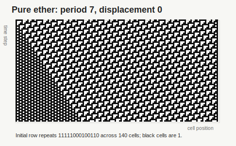
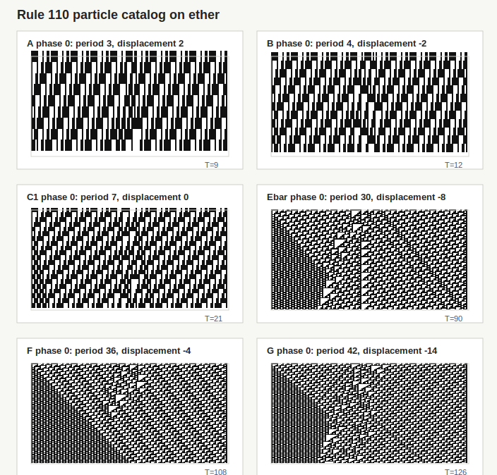
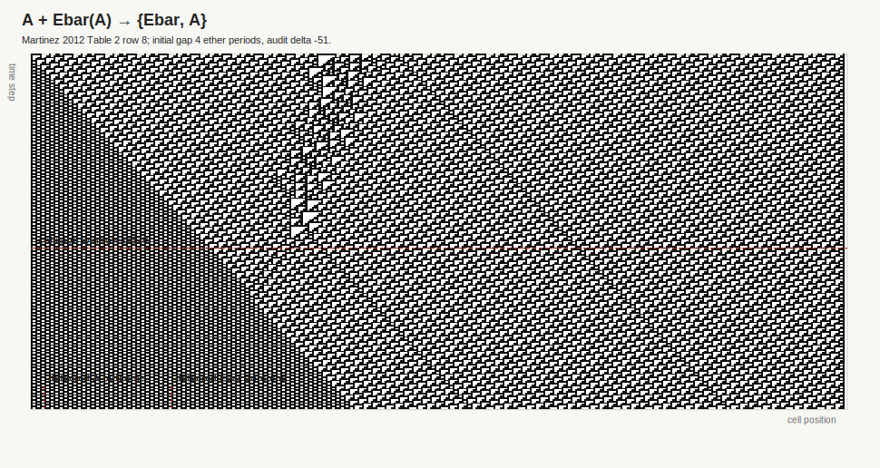
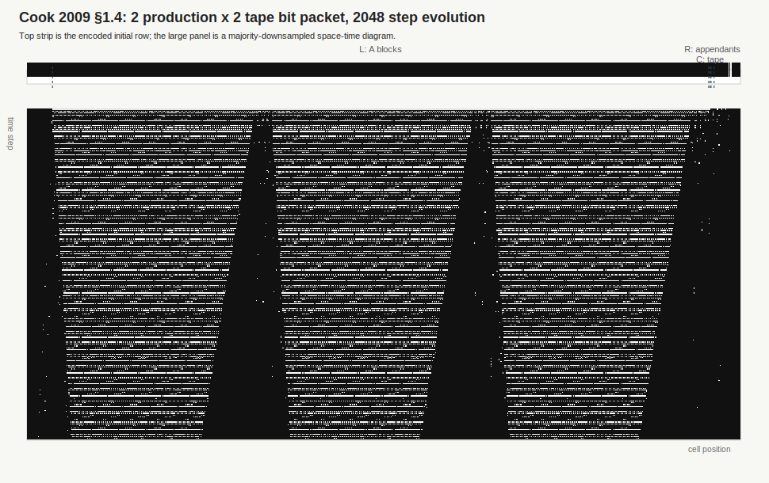
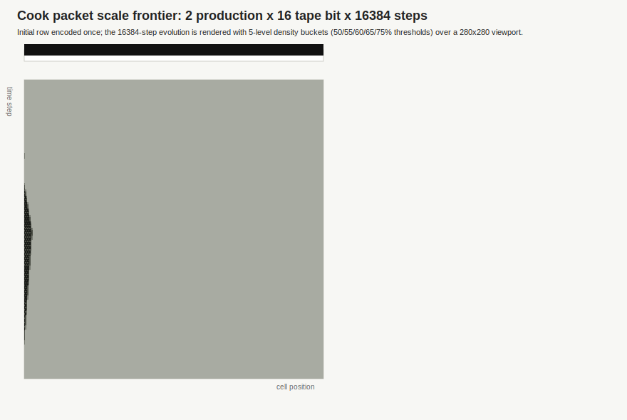

<section class="rule110-section" aria-labelledby="rule110-substrate-title">

Rule 110 substrate visualization

<h2 id="rule110-substrate-title">Foundation → particles → physics → computation</h2>

These space-time diagrams read Rule 110 from the raw ether background up to
Cook packet scale. Horizontal position is cell index, vertical position is
time flowing downward, and black pixels are live cells.

<figure class="rule110-figure">

<figcaption>
<strong>Foundation: pure ether.</strong>
The 14-cell ether pattern repeats over 140 cells and returns to the
same displacement after each 7-step cycle.
</figcaption>
</figure>
<figure class="rule110-figure">

<figcaption>
<strong>Particles: glider catalog.</strong>
A, B, C1, Ebar, F, and G are placed as catalog phase-0 defects on the
ether and evolved for three fundamental periods.
</figcaption>
</figure>
<figure class="rule110-figure wide">

<figcaption>
<strong>Physics: audited Martinez collision.</strong>
The `A(f1_1) -4e- Ebar(A,f1_1) -> {Ebar, A}` row uses the same phase
spacing as the local collision audit and marks the collision window.
</figcaption>
</figure>
<figure class="rule110-figure wide">

<figcaption>
<strong>Computation: Cook packet structure.</strong>
A two-production, two-tape-bit cyclic tag input is encoded with
`cook_encode_phase_exact`; the initial row labels the left periodic
blocks, central tape band, and right appendant blocks.
</figcaption>
</figure>
<figure class="rule110-figure">

<figcaption>
<strong>Scale frontier.</strong>
The `scale_2p_16t_16384` case is evolved for 16384 steps and rendered
with five density buckets (50/55/60/65/75% thresholds) over a 280×280
viewport.
</figcaption>
</figure>

</section>
